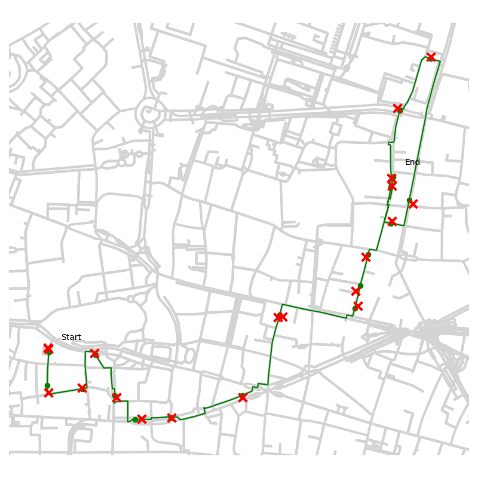
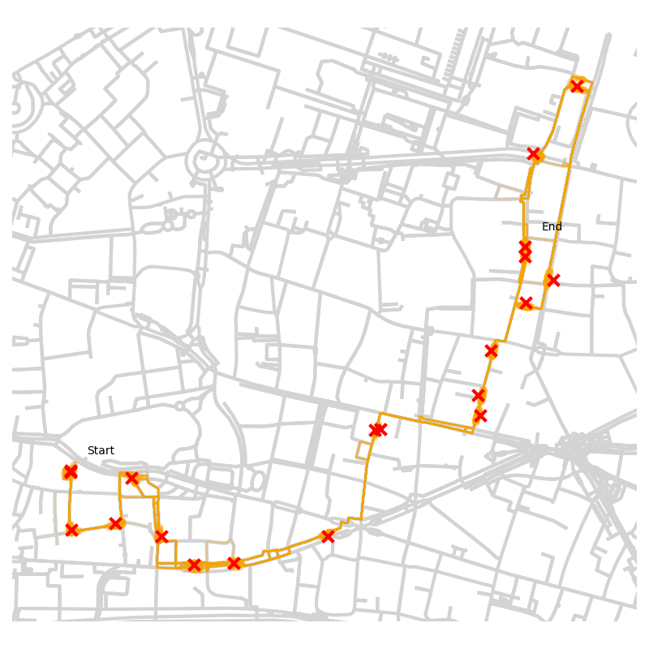

Welcome to ``bmm``'s documentation!
====================================

``bmm`` provides map-matching with uncertainty quantification for both online and offline inference!

Map-matching converts a series of noisy GPS coordinates into a continuous trajectory that is restricted to a graph (i.e. road network) or in the case of ``bmm`` a collection of continuous trajectories representing multiple plausible routes!

``bmm`` is built on top of ``OSMnx``, an `awesome package for retrieving and processing OpenStreetMap data <https://github.com/gboeing/osmnx>`_.

The probabilistic model and particle smoothing methodology behind ``bmm`` can be found on `arXiv <https://arxiv.org/abs/2012.04602>`_
and the source code on `GitHub <https://github.com/SamDuffield/bmm>`_.

Docs
=====================

.. toctree::
    :maxdepth: 3

    functions
    classes
    genindex

Install
=========
``pip install bmm``

Quickstart
===========
Load graph and convert to UTM (Universal Transverse Mercator), a commonly used projection of spherical longtitude-latitude
coordinates into square x-y coordinates::

    import numpy as np
    import pandas as pd
    import osmnx as ox
    import json
    import bmm

    graph = ox.graph_from_place('Porto, Portugal')
    graph = ox.project_graph(graph)

Beware that downloading graphs using ``osmnx`` can take a few minutes, especially for large cities.

Load polyline and convert to UTM::

    data_path = 'simulations/porto/test_route.csv'
    polyline_longlat = json.loads(pd.read_csv(data_path)['POLYLINE'][0])
    polyline_utm = bmm.long_lat_to_utm(polyline_longlat, graph)

Offline map-matching
^^^^^^^^^^^^^^^^^^^^^
::

    matched_particles = bmm.offline_map_match(graph, polyline=polyline_utm, n_samps=100, timestamps=15)

Online map-matching
^^^^^^^^^^^^^^^^^^^^
Initiate with first observation::

    matched_particles = bmm.initiate_particles(graph, first_observation=polyline_utm[0], n_samps=100)

Update when new observation comes in ::

    matched_particles = bmm.update_particles(graph, matched_particles, new_observation=polyline_utm[1], time_interval=15)

Sanity Check
=============
You can manually test that ``bmm`` is working sensibly for a given graph by generating synthetic data::

    graph = ox.graph_from_place('London, UK')
    graph = ox.project_graph(graph)
    generated_route, generated_polyline = bmm.sample_route(graph, timestamps=15, num_obs=20)

Note that the London graph takes some time (~10mins) to download and for testing on synthetic data it may be worth considering a smaller region
(although not so small that the ``sample_route`` function consistently terminates early due to reaching the edge of the graph).

Run map-matching on the generated polyline::

    matched_particles = bmm.offline_map_match(graph, generated_polyline, n_samps=100, timestamps=15)

Plot true generated route::

    bmm.plot(graph, generated_route, generated_polyline, particles_color='green')

Plot map-matched particles::

    bmm.plot(graph, matched_particles, generated_polyline)

